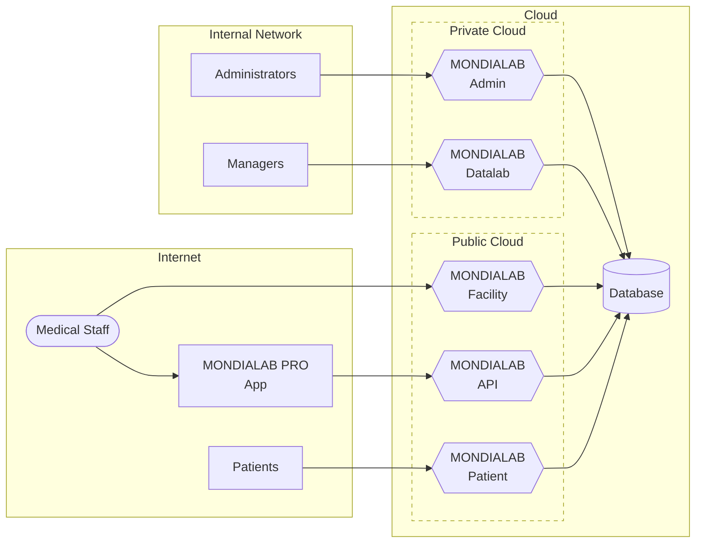

# Mondialab PRO Platform Overview

*Last updated: 2023-01-26*

Users interact with the MONDIALAB platform taking different roles:

- Patients provide their personal information, test samples and access their personal test results
- Medical Staff upload test results and connect test results to patient records
- Managers monitor the tests to detect unusual result patterns and ensure the availability of resources
- Administrators monitor the platform to ensure operation and prevent abuse

Foreach of those roles a separate web frontend tailored to the needs 
of the users is integrated in the MONDIALAB platform.
Those frontends are built upon the same framework but differ in functionality, 
resource requirements and security constraints. 

## Structure

## Hardware Requirements

### Database

The central database server running a MariaDB database.

Required:

    CPUS:      2
    MEMORY:    4GB
    Diskspace: 100GB

Recommended:
    
    CPUS:      8
    MEMORY:    64GB
    Diskspace: 1TB

### Admin Frontend

The administration frontend accessed by administrators.

- User management
- Device management
- kPlex management

Required:

    CPUS:      1
    MEMORY:    2GB
    Diskspace: 20GB

Recommended:
    
    CPUS:      4
    MEMORY:    8GB
    Diskspace: 20GB

### Datalab Frontend

The datalab frontend accessed by managers to 

- get overview over executed tests and results
- forecast tests results
- monitor resources

Required:

    CPUS:      2
    MEMORY:    4GB
    Diskspace: 20GB

Recommended:
    
    CPUS:      8
    MEMORY:    32GB
    Diskspace: 20GB

### Facility Frontend

The facility frontend accessed by medical personal.

- Check in patients
- Upload test results

Required:

    CPUS:      1
    MEMORY:    2GB
    Diskspace: 20GB

Recommended:
    
    CPUS:      8
    MEMORY:    32GB
    Diskspace: 20GB

### Patient Frontend

The patient frontend accessed by patients. 

- provide personal information
- checkin at facilities
- access test results

Required:

    CPUS:      1
    MEMORY:    2GB
    Diskspace: 20GB

Recommended:
    
    CPUS:      8
    MEMORY:    32GB
    Diskspace: 20GB

### API

The API used by the MONDIALAB PRO app. 

Required:

    CPUS:      1
    MEMORY:    2GB
    Diskspace: 20GB

Recommended:
    
    CPUS:      8
    MEMORY:    32GB
    Diskspace: 20GB

## Deployment and software requirements

It's recommended to use `Ubuntu 22.04 Server` as operating system.

An `Ansible` based deployment is available.

A (sub) domain name is required for the platform.

Example:

    mohe.example.com

from this main domain name a number of sub domains will be derived which need to be assigned: 

    database.mohe.example.com
    admin.mohe.example.com
    api.mohe.example.com
    datalab.mohe.example.com
    facility.mohe.example.com
    patient.mohe.example.com
